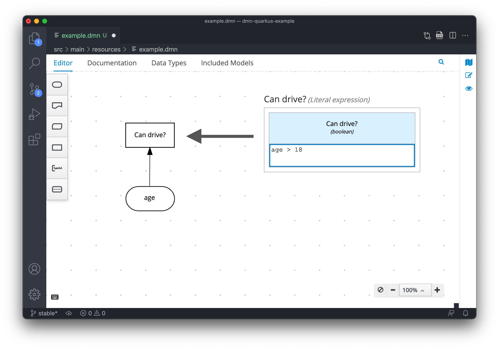

#### 1. Example with the `age` node connected to the decision node `Can drive?`



```
// With "age" = 10
{"age":10,"Can drive?":false}

// With "age" = 19
{"age":19,"Can drive?":true}

// Without "age"
{"namespace":"https://kiegroup.org/dmn/_2B1023A7-7638-4946-8848-9E3E44795624","modelName":"example","dmnContext":{},"messages":[{"severity":"ERROR","message":"Required dependency 'age' not found on node 'Can drive?'","messageType":"REQ_NOT_FOUND","sourceId":"_56BD5579-B61F-4D75-8978-823EDD144076","level":"ERROR"}],"decisionResults":[{"decisionId":"_56BD5579-B61F-4D75-8978-823EDD144076","decisionName":"Can drive?","result":null,"messages":[{"severity":"ERROR","message":"Required dependency 'age' not found on node 'Can drive?'","messageType":"REQ_NOT_FOUND","sourceId":"_56BD5579-B61F-4D75-8978-823EDD144076","level":"ERROR"}],"evaluationStatus":"SKIPPED"}]}
```

⚠️ Notice the error message: **Required dependency 'age' not found on node 'Can drive?'**

---

#### 2. Example with the `age` node non-connected to the decision node `Can drive?`


```
// With "age" = 10
{"age":10,"Can drive?":false}

// With "age" = 19
{"age":19,"Can drive?":true}

// Without "age"
{"namespace":"https://kiegroup.org/dmn/_2B1023A7-7638-4946-8848-9E3E44795624","modelName":"example","dmnContext":{},"messages":[{"severity":"ERROR","message":"FEEL ERROR while evaluating literal expression 'age > 18': Unknown variable name 'age'","messageType":"FEEL_EVALUATION_ERROR","sourceId":"_1913EAE4-F19A-4721-A701-42C8225F90E3","level":"ERROR"}],"decisionResults":[{"decisionId":"_56BD5579-B61F-4D75-8978-823EDD144076","decisionName":"Can drive?","result":null,"messages":[],"evaluationStatus":"FAILED"}]}
```

⚠️ Notice the error message: **Unknown variable name 'age'**

---

#### 3. Example with the `age-1` node non-connected to the decision node `Can drive?`


```
// With "age-1" = 19
{"namespace":"https://kiegroup.org/dmn/_2B1023A7-7638-4946-8848-9E3E44795624","modelName":"example","dmnContext":{"age-1":19},"messages":[{"severity":"ERROR","message":"FEEL ERROR while evaluating literal expression 'age-1 > 18': Unknown variable name 'age'","messageType":"FEEL_EVALUATION_ERROR","sourceId":"_1913EAE4-F19A-4721-A701-42C8225F90E3","level":"ERROR"}],"decisionResults":[{"decisionId":"_56BD5579-B61F-4D75-8978-823EDD144076","decisionName":"Can drive?","result":null,"messages":[],"evaluationStatus":"FAILED"}]}
```

⚠️ Notice that, even being a valid name, the logic is not executed.

Finally, if we connect nodes, we get the expected response:

```
{"age-1":19,"Can drive?":true}
```
