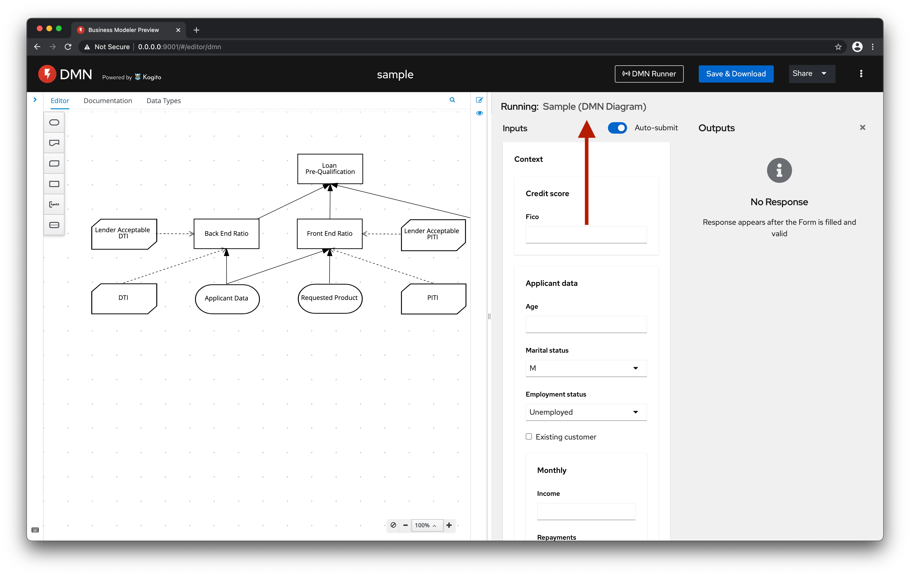
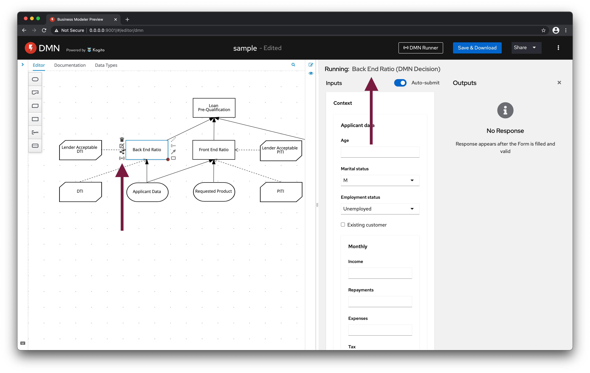
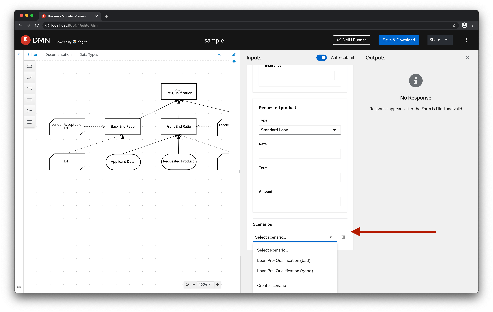

This page covers two ideas related to the DMN evaluation dock.

#### 1. Show the execution target

We could show the name of the DMN diagram at the top of the dock:

Thus, when support the execution per node, users would be able to distinguish the target of the execution easily:

#### 2. Execution scenarios

We could enable users to persist different sets of input data. So, they would be able to easily switch between then, remove, and create new ones:

As a long-term goal, we could export these scenarios to a `.scesim` asset.
