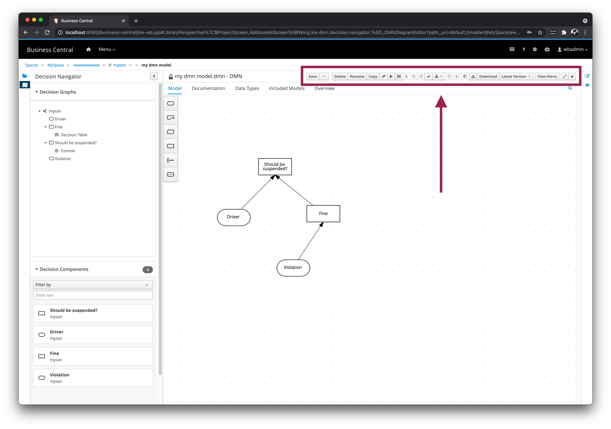
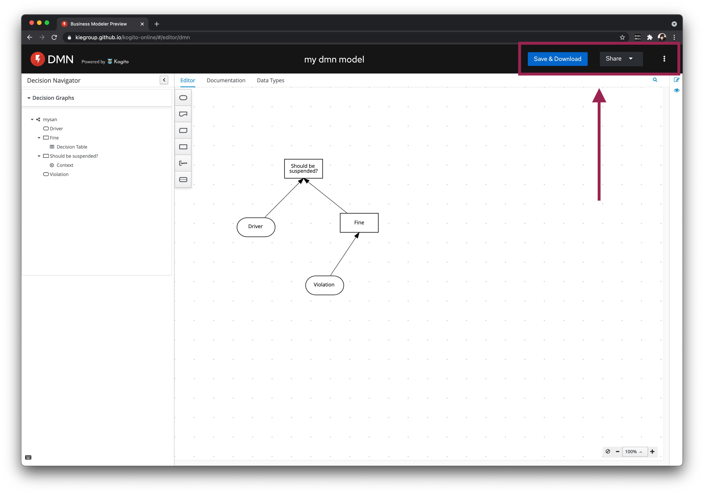
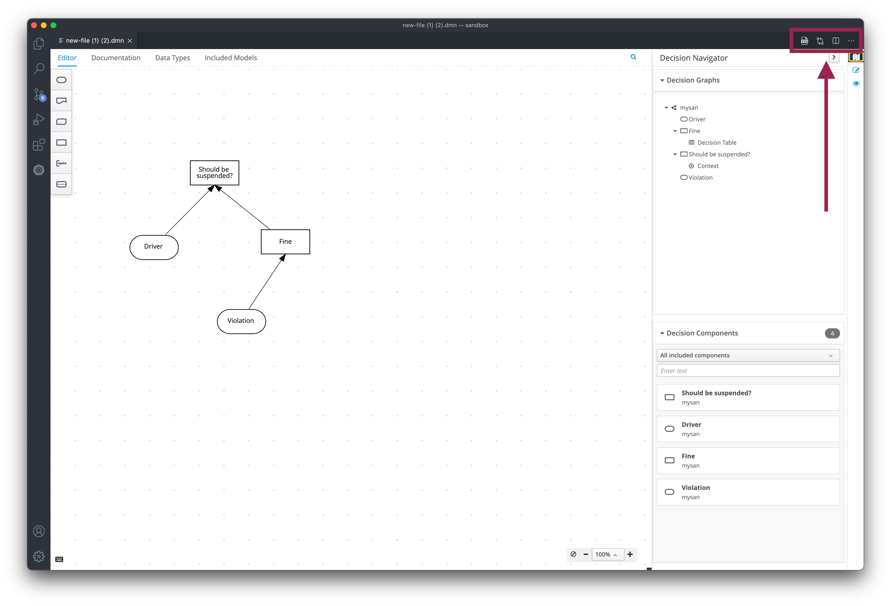
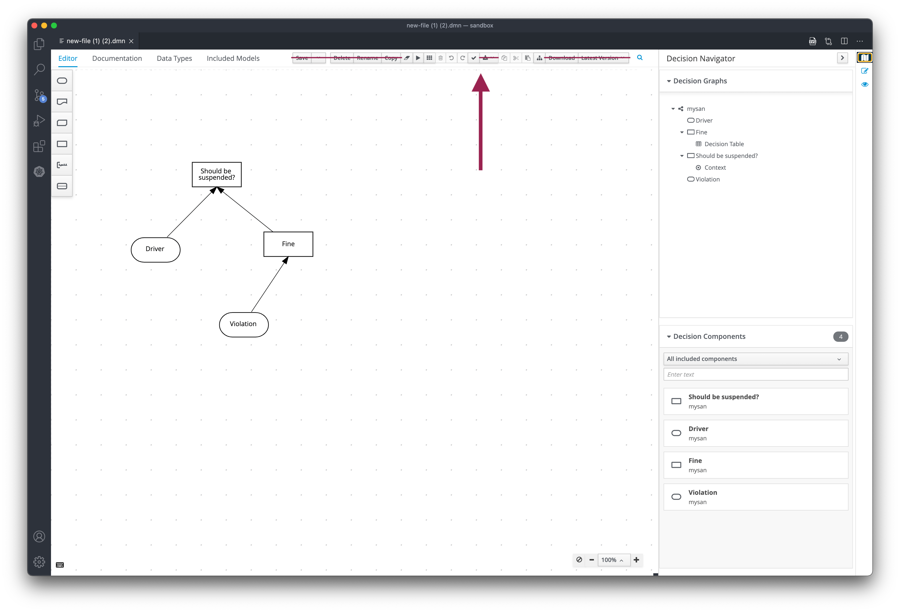
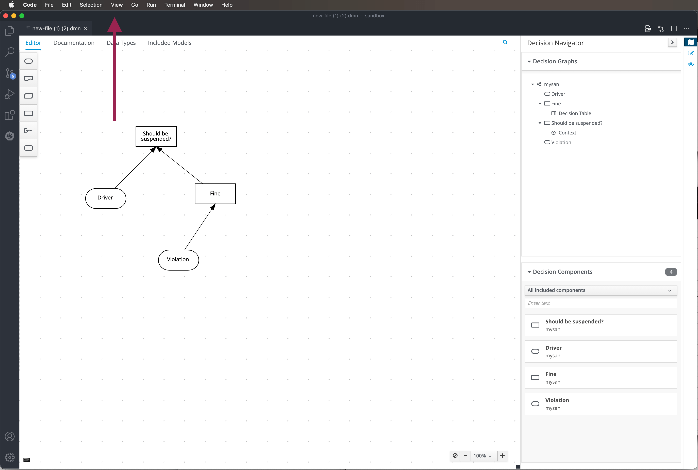

### Current state of editors

#### Business Central

#### Online Editor

#### VSCode

---

### Proposals

#### A) Use the tabs bar

It's important to mention that we would need to considerate to move actions from the existing components (pointed in the screenshots above) to the new bar.

#### B) Use the existing components

It's important to mention that the existing components in the Online Editor and in the VSCode are a bit different.

#### C) Use VSCode menu bar

It's important to mention that Online Editor does not have this menu bar.

