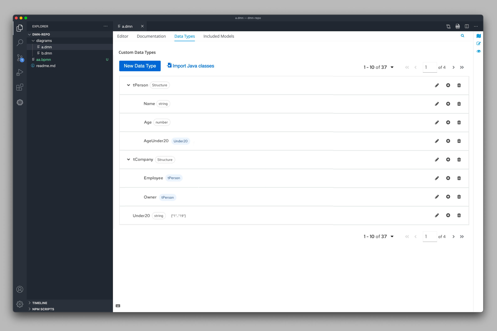
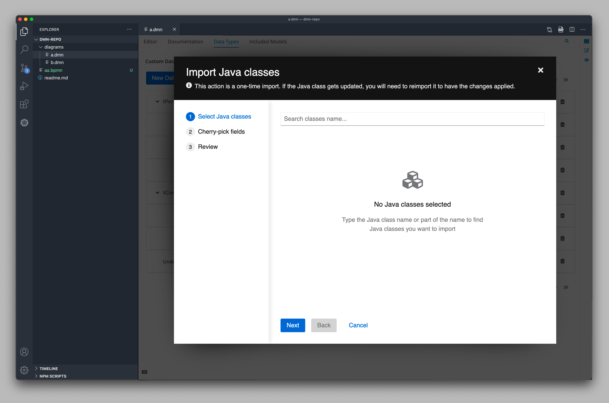
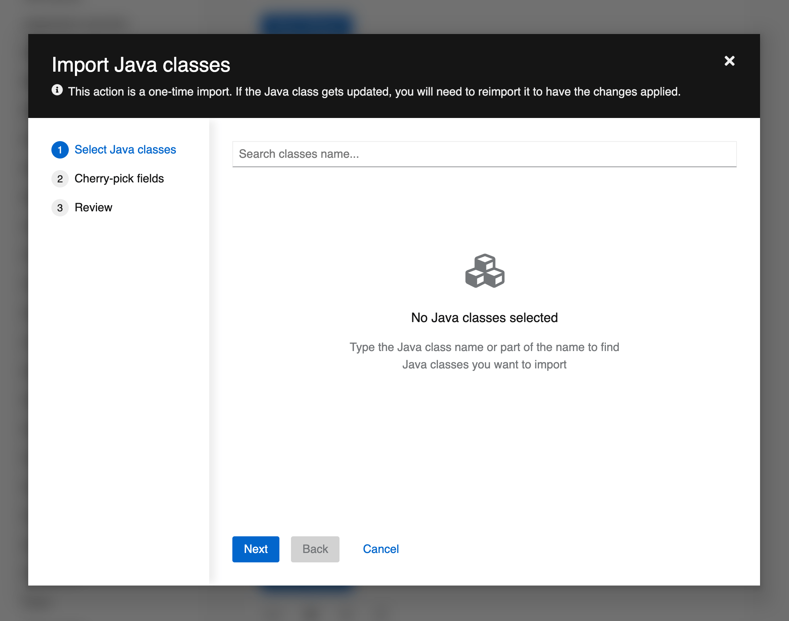
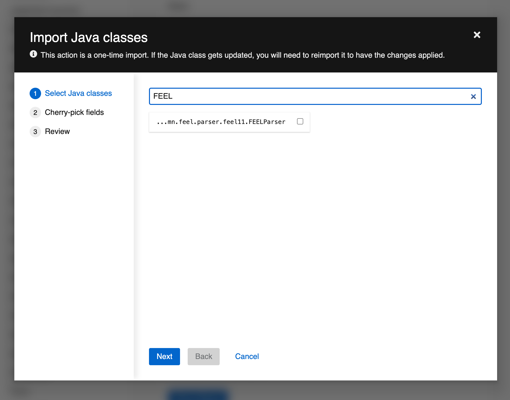
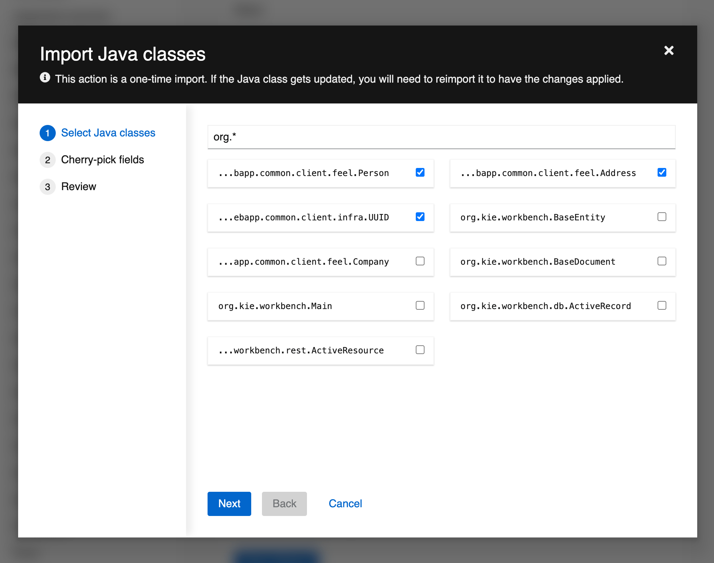
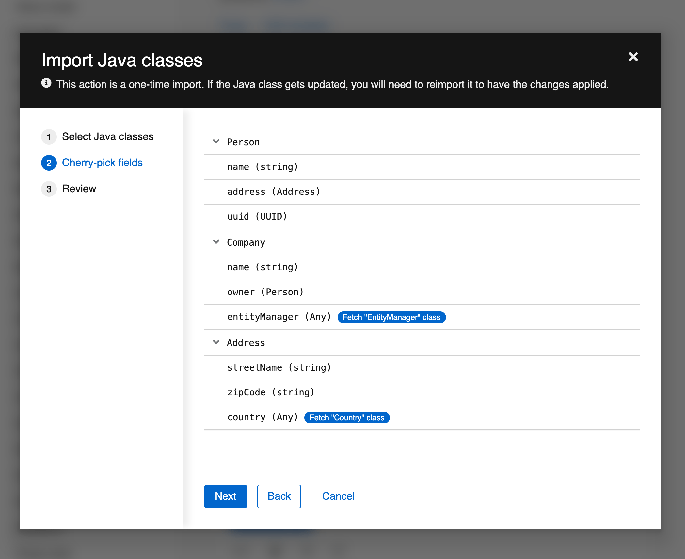
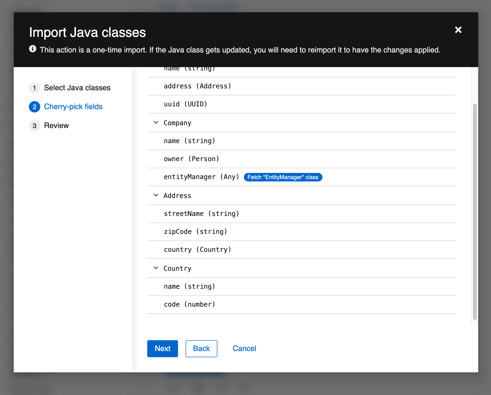
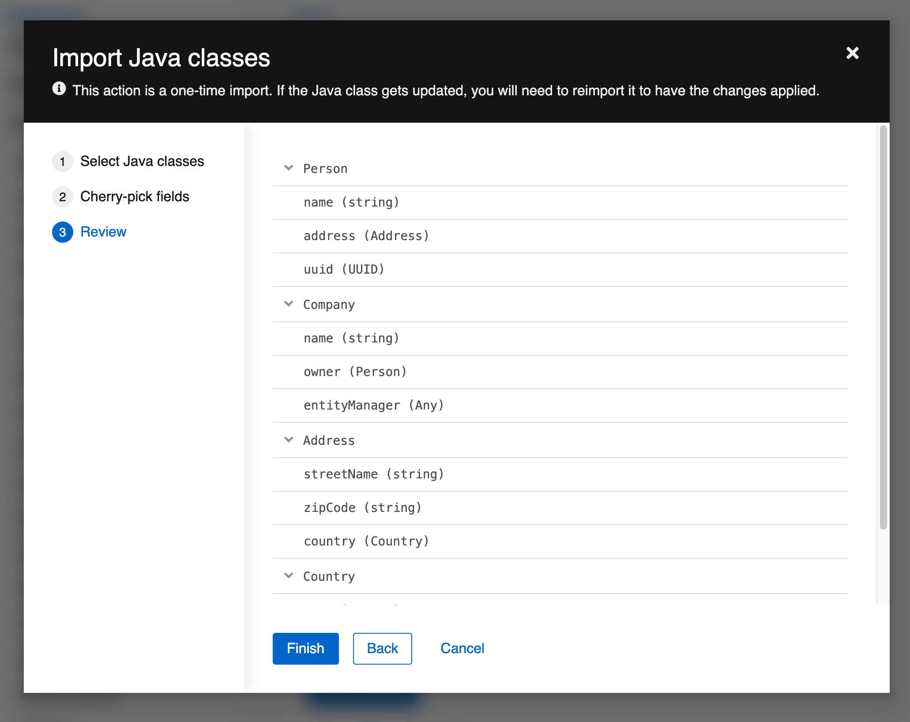

This page is a proposal for [KOGITO-4269](https://issues.redhat.com/browse/KOGITO-4269), and it's fully based on [patternfly.org/v4](https://www.patternfly.org/v4/) components.

### Editor changes

- Introduce a new **"Import Java classes"** button (here's the icon: [fontawesome.com/icons/file-import](https://fontawesome.com/icons/file-import?style=solid))
- The "**Import Java classes**" button triggers a [patternfly-v4-Wizard](https://www.patternfly.org/v4/components/wizard/#wizard-in-modal)

### Wizard component

#### 1. Select Java classes

In the first step, we're explaining to users how the import feature works (the info text in the header is analog to what we have on BC, but it's a bit simpler here)

- When users open this wizard, they face an empty state guiding them to start looking for classes

- Users rely on a live search [1] input to search for Java classes
- Each class is represented by a [patternfly-v4-card](https://www.patternfly.org/v4/components/card) component
- [1] It's important to be diligent with the live search mechanism (consider we will be performing backend requests in the LSP service)

- The input component accepts expressions like this to search for classes inside of a specific package
- Users select only relevant classes by check-boxing them
- The selected classes remain on the screen, even if users delete the text in the search input

#### 2. Cherry-pick fields

- In the second step, users see all fields from the classes they just selected
- Users can still include classes by using the fetch-buttons, like the "**Fetch Country class**"
- I'm not sure if "**Cherry-pick fields**" the best name for this section

> ##### 📖 The lazy mechanism
> 
> - Notice that `Person` and `Company` classes were selected during the first step. So, here, the `owner` field (in the `Company` structure data type) has the type already associated
> 
> - Notice that `Address` was selected, but `Country` was not selected in the first step. Thus, the `country` field (in the `Address` structure data type) is considered as `Any`
> 

- Notice that in the prototype, the `Country` class appears now in the list
- This list of data types is based on the [patternfly-v4-table](https://www.patternfly.org/v4/components/table#expandable)
- The "**Fetch \<CLASS_NAME> class**" button is based on the [patternfly-v4-badge](https://www.patternfly.org/v4/components/badge)

#### 3. Review

- The third and review step is just like the second type, but it's a read-only list without any action
- I'm not sure if we _need_ this step. I personally believe it's nice to have a final step like this representing the concluded work

